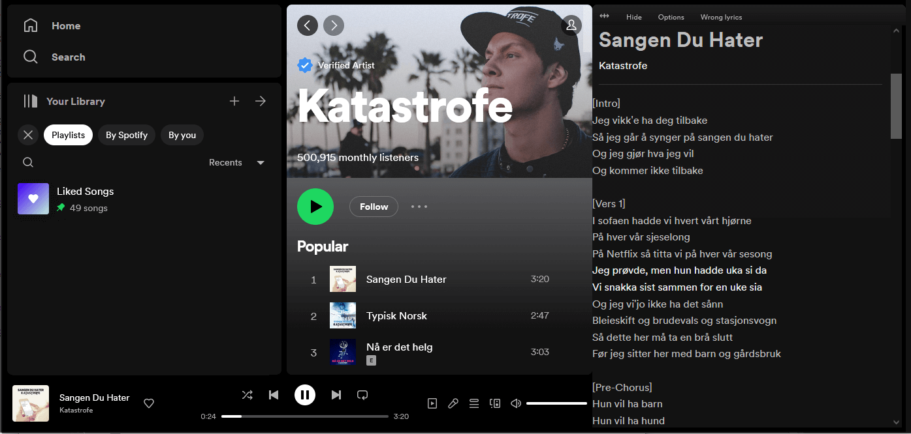
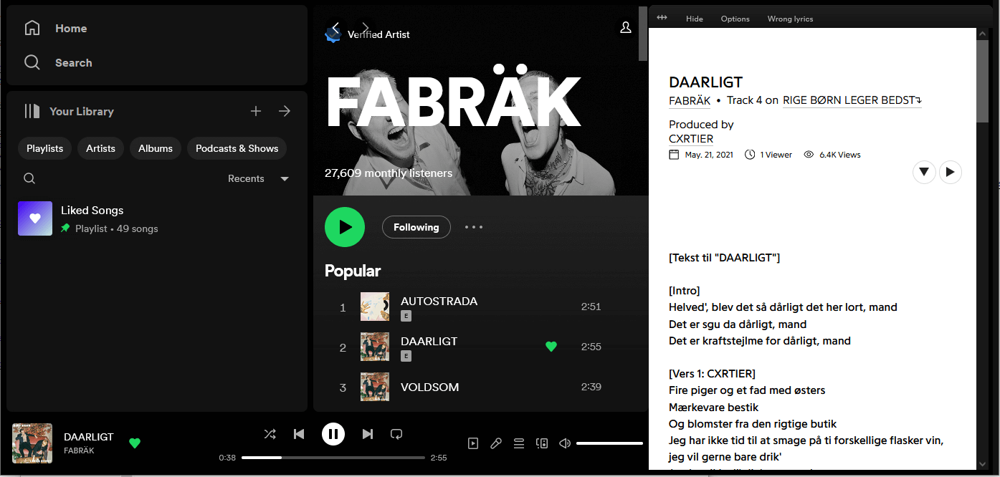
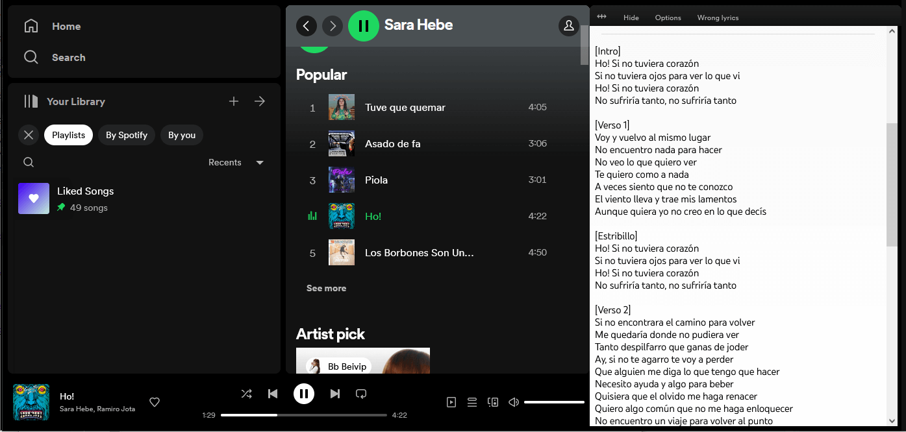

# Spotify-Genius-Lyrics-userscript
A userscript or greasemonkey script that shows lyrics from [genius.com](https://genius.com/) on the [Spotify Web Player](https://open.spotify.com/)

It's primarily designed for Firefox and Chrome with
[Tampermonkey](https://www.tampermonkey.net/)  .

This userscript **DOES NOT** work with Greasemonkey because of [this bug greasemonkey/issues/2574](https://github.com/greasemonkey/greasemonkey/issues/2574) in Greasemonkey.

If you already have a userscript extension installed, you can install it below:

[**Click here to install**](https://greasyfork.org/scripts/377439-spotify-genius-lyrics/code/Spotify%20Genius%20Lyrics.user.js) 
Tested with Firefox/**Tampermonkey** and Chrome/**Tampermonkey**.

Family of GeniusLyrics Userscripts:
*   Powered by **GeniusLyrics Library** [GitHub](https://github.com/cvzi/genius-lyrics-userscript/) [Greaskfork](https://greasyfork.org/en/scripts/406698-geniuslyrics)
*   **Spotify Genius Lyrics** [GitHub](https://github.com/cvzi/Spotify-Genius-Lyrics-userscript) [Greaskfork](https://greasyfork.org/en/scripts/377439-spotify-genius-lyrics)
*   **Youtube Genius Lyrics** [GitHub](https://github.com/cvzi/Youtube-Genius-Lyrics-userscript) [Greaskfork](https://greasyfork.org/en/scripts/386259-youtube-genius-lyrics)
*   **Youtube Music Genius Lyrics** [GitHub](https://github.com/cvzi/Youtube-Music-Genius-Lyrics-userscript/) [Greaskfork](https://greasyfork.org/en/scripts/406892-youtube-music-genius-lyrics)

### Contributors:

Screenshot (Spotify theme):

Screenshot (Genius theme):

Screenshot (Clean white theme):

