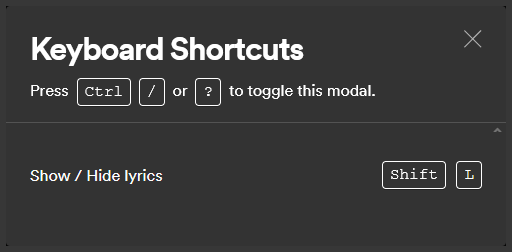
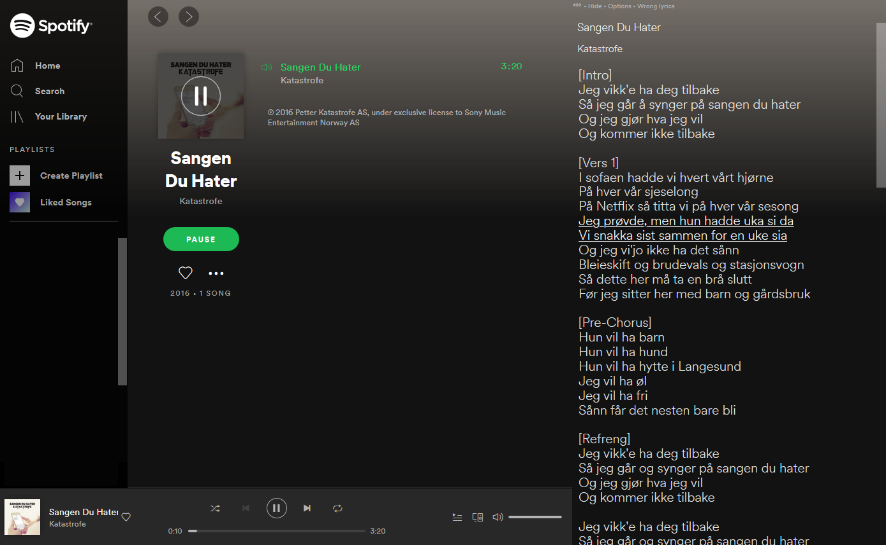

# Spotify-Genius-Lyrics-userscript
A userscript or greasemonkey script that shows lyrics from [genius.com](https://genius.com/) on the [Spotify Web Player](https://open.spotify.com/)

It's primarily designed for Firefox and Chrome with
[Tampermonkey](https://www.tampermonkey.net/)  
or
[FireMonkey ](https://addons.mozilla.org/en-US/firefox/addon/firemonkey/).

This userscript **DOES NOT** work with Greasemonkey because of [this bug greasemonkey/issues/2574](https://github.com/greasemonkey/greasemonkey/issues/2574) in Greasemonkey.

If you already have a userscript extension installed, you can install it below:

[**Click here to install**](https://openuserjs.org/install/cuzi/Spotify_Genius_Lyrics.user.js) 
Tested with Firefox/**Tampermonkey** and Chrome/**Tampermonkey**.

Similar scripts:
*   [Youtube Genius Lyrics](https://github.com/cvzi/Youtube-Genius-Lyrics-userscript)
*   [Youtube Music Genius Lyrics](https://github.com/cvzi/Youtube-Music-Genius-Lyrics-userscript)

Screenshot:

Screenshot:

Screenshot:

